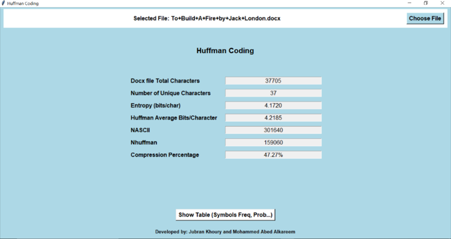
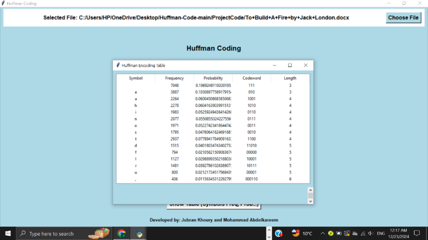

# Huffman-Code

## Overview
This project demonstrates the implementation of Huffman coding, a lossless data compression technique, to analyze and compress the text of the story *"To Build A Fire" by Jack London*. The Python program features a graphical user interface (GUI) for interactive use.

### Key Features:
- Calculate total character count and unique character count.
- Compute character frequencies, probabilities, and entropy.
- Generate Huffman codes for characters and compare average bits per character with entropy.
- Assess the compression efficiency of Huffman coding relative to ASCII encoding.
- Display results interactively on a GUI.

## Theoretical Background
Huffman coding is a lossless data compression method that assigns shorter binary codes to frequently occurring characters and longer codes to less frequent ones. This project implements Huffman coding by constructing a binary tree (Huffman Tree) using a min heap as a priority queue. The steps to create the tree include:
1. Creating leaf nodes for each character.
2. Combining nodes with the smallest frequencies.
3. Repeating the process until a single root node remains.

## Results
The analysis of the input story yielded the following results:
- **Total Characters**: 37,705
- **Unique Characters**: 37
- **Entropy**: 4.1720 bits/character
- **Huffman Average Bits/Character**: 4.2185
- **Total Bits (Huffman)**: 159,060
- **Total Bits (ASCII)**: 301,640
- **Compression Ratio**: 53%

The Huffman coding achieved a significant compression ratio of 53% compared to ASCII encoding, reducing the encoded data size to 47% of its original size.

### Sample Calculations:
| Symbol | Probability | Code-word | Length of Code-word |
|--------|-------------|-----------|---------------------|
| a      | 0.0600      | 1001      | 4                   |
| b      | 0.0128      | 100000    | 6                   |
| c      | 0.0206      | 110110    | 6                   |
| e      | 0.1030      | 010       | 3                   |
| space  | 0.1869      | 111       | 3                   |

### GUI Screenshots
Below are screenshots of the GUI demonstrating the project’s functionality:

**Huffman Coding Overview:**



**Character Frequency Table:**



## How to Run
1. Clone this repository.
2. Install the required dependencies using `pip install -r requirements.txt`.
3. Run the program:
   ```
   python GUI.py
   ```
4. Use the GUI to upload the ```.docx``` file and analyze compression results.

## Conclusion
This project provides a practical understanding of Huffman coding and its implementation. The process highlights the efficiency of lossless compression techniques and their application in real-world scenarios.

